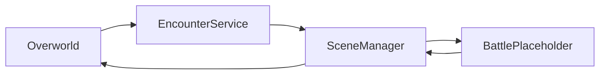

# Plano de arquitetura e organização - Pokemon 2D em Godot

## Objetivo

Construir um jogo 2D estilo Pokemon (top-down) em Godot 4.6, aprendendo Godot e GDScript enquanto implementamos um **vertical slice** inicial:

- Overworld com **TileMap**, movimentação **livre** em 4 direções + colisão.
- Interação com **NPC/placas**.
- **Encontro aleatório** em área de grama, que abre uma **batalha placeholder** (somente entrada/saída e UI mínima).

## Restrições já fixas no projeto

- Engine Godot 4.6 e projeto já criado.
- Renderer no Windows: d3d12.
- Física 3D: Jolt (irrelevante para 2D, mas não mexer).

Referência: [`project.godot`](project.godot:1)

## Não-objetivos do vertical slice (por enquanto)

- Batalha completa por turnos (dano, turn order, status, itens, captura).
- Pokedex, evolução, breeding, habilidades, etc.
- Sistema de salvar/carregar.

Esses itens entram depois, quando o loop Overworld -> Encontro -> Placeholder estiver sólido.

---

## Organização do projeto (res://)

Estrutura proposta para manter leve e scene-script centric:

```
res://
  scenes/
    game/
      Game.tscn
      TransitionLayer.tscn
    overworld/
      Overworld.tscn
      Player.tscn
      NPC.tscn
      Sign.tscn
      EncounterArea.tscn
    battle/
      BattlePlaceholder.tscn
    ui/
      DialogueBox.tscn

  scripts/
    autoload/
      SceneManager.gd
      GameState.gd
      DataRegistry.gd
    overworld/
      PlayerController.gd
      Interactable.gd
      InteractionDetector.gd
      EncounterService.gd
      StepTracker.gd
    battle/
      BattlePlaceholderController.gd
    data/
      PokemonSpeciesResource.gd
      MoveResource.gd
      EncounterTableResource.gd

  data/
    species/
    moves/
    encounter_tables/

  assets/
    sprites/
    tilesets/
    audio/
```

Notas:

- `res://data/` guardará os arquivos `.tres` ou `.res` (Resources) editáveis no Inspector.
- `res://scripts/data/` guardará as classes `class_name` que tipam esses Resources.
- `assets/` é somente mídia crua (sprites, tilesets, áudio) e seus `.import`.

---

## Arquitetura de cenas e transições

### Cena raiz

**Game.tscn** como cena raiz do jogo.

Responsabilidades:

- Instanciar e manter a cena atual de gameplay (Overworld ou BattlePlaceholder).
- Expor pontos únicos para transição (ex: fade) e troca de cena.

### Autoloads mínimos

Manter de 1 a 3 autoloads, pequenos e explícitos:

- **SceneManager**: troca de cenas + transição (fade) e passagem de payload.
- **GameState**: estado do jogo necessário para o fluxo (ex: mapa atual, posição de retorno do player, payload do encontro atual).
- **DataRegistry**: carregamento e cache de Resources de dados (species, moves, encounter tables).

### Fluxo do vertical slice



Contrato de payload (mínimo) entre Overworld e BattlePlaceholder:

- `species_id`
- `level`
- `encounter_source` (ex: grass)
- `return_map_id`
- `return_position`

---

## Overworld

### Player

- `CharacterBody2D` com movimentação em 4 direções.
- Implementar movimento no `_physics_process(delta)`.
- Separar input de lógica via Input Map.

Input actions (primeiro conjunto):

- `move_up`
- `move_down`
- `move_left`
- `move_right`
- `interact`

### Colisão

- Colisão via TileMap/TileSet (camada com collision shapes) e/ou `StaticBody2D`.
- Player colide usando `CollisionShape2D`.

### Interação com NPC/placas

Padrão recomendado:

- Objetos interagíveis entram no grupo `interactable`.
- Cada `NPC` e `Sign` expõe um método padrão `interact()` ou um sinal `interacted`.
- O Player tem um `InteractionDetector` (ex: `Area2D` à frente do personagem, reposicionado conforme facing).
- Ao apertar `interact`, o detector procura sobreposições e chama `interact()` no primeiro alvo válido.

UI:

- `DialogueBox.tscn` placeholder com:
  - texto
  - botão avançar

---

## Encontros aleatórios em grama

### Ponto único de disparo

- `EncounterArea.tscn` (baseado em `Area2D`) define zonas de grama.
- O Overworld ou o Player reporta ao `EncounterService` quando:
  - entrou/saiu da área
  - completou um passo (ver StepTracker)

### StepTracker para movimento livre

Como o movimento é livre, precisamos converter deslocamento em passos:

- `StepTracker` acumula distância percorrida.
- Ao passar de um limiar `step_distance_px`, emite um sinal `step()`.

Isso evita o anti-pattern de checar encontro todo frame.

### Probabilidade e cooldown

- `EncounterService` roda a rolagem de encontro apenas em `step()`.
- Regras mínimas:
  - `encounter_chance` por passo (ex: 5 a 15 por cento, calibramos depois)
  - `min_steps_between_encounters` para evitar encontro em loop

### Tabela por mapa

- Cada mapa (ou área) aponta para uma `EncounterTableResource`.
- A tabela define uma lista ponderada de species e níveis.

---

## Batalha placeholder

Escopo:

- Receber payload do encontro.
- Mostrar texto do tipo:
  - Um Pokemon selvagem apareceu: {species_id} lvl {level}
- Um botão `Voltar` que retorna para o Overworld na posição anterior.

Critérios de pronto:

- Entrar e sair sem perder estado.
- Voltar para o overworld na posição correta.

---

## Modelo de dados (Godot Resources)

Começar com Resources tipados por ser rápido de iterar no Inspector.

### PokemonSpeciesResource

Campos mínimos:

- `id` (string, estável)
- `display_name` (string)
- `types` (array)
- `base_stats` (hp, atk, def, spa, spd, spe)
- `front_sprite` (Texture2D)
- `back_sprite` (Texture2D)

### MoveResource

Campos mínimos:

- `id`
- `display_name`
- `type`
- `power`
- `accuracy`

### EncounterTableResource

Campos mínimos:

- `id`
- `entries`: lista com
  - `species_id`
  - `weight`
  - `min_level`
  - `max_level`

Estratégia de IDs:

- `species_id` e `move_id` devem ser strings estáveis, usadas como chave de lookup.
- Manter IDs separados de `display_name` para permitir renomear sem quebrar save futuro.

---

## Convenções

- Cenas: PascalCase e sufixo consistente, ex: `Overworld.tscn`, `BattlePlaceholder.tscn`.
- Scripts: PascalCase para classes e `class_name` quando fizer sentido.
- Sinais: snake_case, ex: `step`, `interacted`, `encounter_started`.
- Manter arquivos `.gd.uid` versionados e não remover.

---

## Milestones de aprendizado alinhadas às entregas

- **M0**: estrutura de pastas, cenas base, Input Map, autoloads mínimos.
- **M1**: Player movement + colisão.
- **M2**: Interação com NPC/placa + DialogueBox placeholder.
- **M3**: EncounterArea + StepTracker + EncounterService abrindo batalha placeholder.
- **M4**: Dados em Resources (species, encounter table) alimentando o encontro e UI.
- **M5**: polimento do loop (câmera, animações, transições) e preparar a batalha real.

---

## Checklist de validação manual (no editor)

- Player anda, para ao soltar tecla e não atravessa paredes.
- Interact funciona e dispara uma única vez por input.
- Entrar em grama e andar dispara encontros com chance e cooldown.
- Batalha placeholder abre, mostra payload e volta corretamente.

